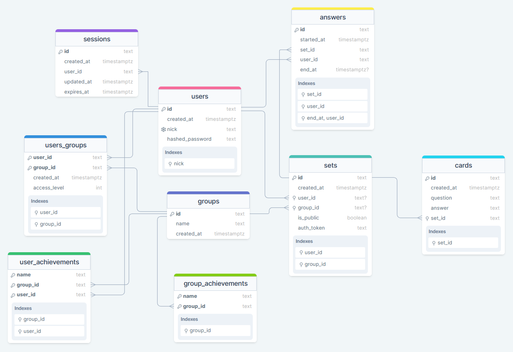

# Flashcards application

Application aimed at students learning things

General functionalities

- registering/logging users
- user can create/join study group
- each group has an administrator 

- admin can create/select available achievements
- admin can kick people out of the group
- admin can promote to admin
- admin can define what each user can do (add/remove/modify sets)

- user can create private/public/group flashcard sets
- user can study the flashcard set
- user can share private flashcard set
- user can clone/modify flashcard set

- measuring best completion time, completion count for each card speed for each card etc.
- user can get achievements in study group based on completion time or streaks

## Database schema

## Code organization

### Controllers

There are three main controllers:
- user:  for user account creation and logins
- study group: for group creation/modification, managing group users and available achievement
- flashcard set: for sets, modyfing cards and submitting answers

### Models

Three main types of models are:
- database: representing SQL database entities and relations
- api input: for user inputs
- api outputs: converting db models into api responses

Others include:
- id classes for database models
- classess impelementing achievements

### Repositories and services

Every database model class has its own repository with SQL implementations of complex queries. Services are responsible for validation, verification and low-level implementation of busineess logic.

### Utils

Classes for easy error throwing, authenticating, setting headers etc.

## Endpoints

| Path         | Method     | Auth required | Role required | description |
|--------------|-----------|------------|------------|----|
| /users | POST | no | | register new user |
| /users | GET | yes | | returns current user info |
| /users/login | POST       |   yes      |   | logs in user, sets sid cookie header  |
| /users/session | POST | yes |  | session refresh |
| /users/logout | POST | yes |  | remove session |
| /study_groups | GET | yes |  | returns all groups user belongs to |
| /study_groups | POST | yes |  | create new group, user becomes admin |
| /study_groups/{group_id} | GET | yes | group guest or admin | returns group info |
| /study_groups/{group_id} | PATCH | yes | group admin | update group info |
| /study_groups/{group_id} | DELETE | yes | group admin | remove group |
| /study_groups/{group_id}/join | POST | yes |  | join group as guest |
| /study_groups/{group_id}/users | GET | yes | group guest or admin | returns users in group |
| /study_groups/{group_id}/users/{user_id} | PATCH | yes | group admin | update user role |
| /study_groups/{group_id}/users/{user_id} | PATCH | yes | group admin | update user role |
| /study_groups/{group_id}/users/{user_id} | DELETE | yes | group admin | remove user from group |
| /study_groups/{group_id}/users/{user_id}/achievements | GET | yes | group guest | return user achievements |
| /study_groups/{group_id}/flashcard_sets | GET | yes | group guest or admin | returns sets in a group |
| /study_groups/{group_id}/achievements | GET | yes | group guest or admin | returns achievements available in a group |
| /study_groups/{group_id}/achievements/{achievement_name} | PUT | yes | group admin | enable achievement |
| /study_groups/{group_id}/achievements/{achievement_name} | DELETE | yes | group admin | disable achievement |
| /flashcard_sets | GET | no |  | returns public and user owned sets |
| /flashcard_sets | POST | yes |  | create new set (owned by user) |
| /flashcard_sets/{set_id} | GET | no* | set owner, group user or public set | return set info |
| /flashcard_sets/{set_id} | PATCH | yes | set owner or group admin | edit set info |
| /flashcard_sets/{set_id} | DELETE | yes | set owner or group admin | remove set |
| /flashcard_sets/{set_id}/cards | GET | no* | set owner, group user of public set | return cards in a set |
| /flashcard_sets/{set_id}/cards | POST | yes | set owner or group admin | add card to a set |
| /flashcard_sets/{set_id}/cards/{card_id} | PATCH | yes | set owner or group admin | edit card |
| /flashcard_sets/{set_id}/cards/{card_id} | DELETE | yes | set owner or group admin | remove card |
| /flashcard_sets/{set_id}/answers | POST | yes* | any logger user for public sets or group guest for group sets | submit answers |
|  |  |  |  |  |